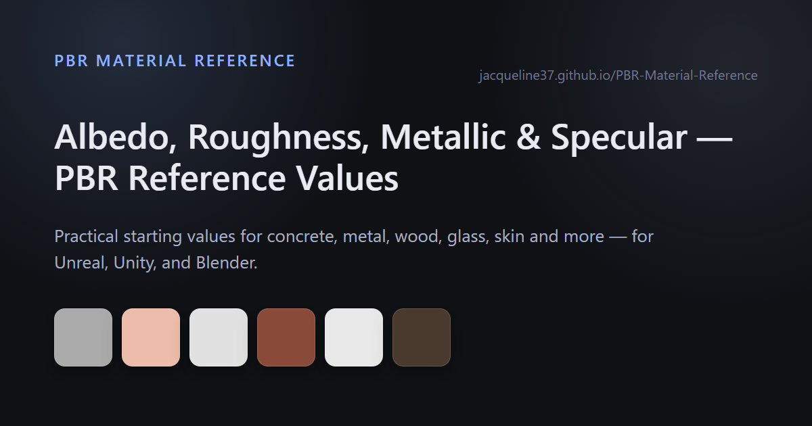

# PBR Material Reference

A small web tool that gives realistic starting values for CG, rendering, and game engine material setup — no more guessing what "concrete" or "brushed aluminium" should look like in your shader graph.

**[Open the live tool →](https://jacqueline37.github.io/PBR-Material-Reference/)**

---

## What it gives you

For each material, the tool provides:

- Albedo (linear / sRGB)
- Reflectance
- Roughness
- Metallic
- Specular / F0

Values are based on measured reflectance ranges for clean, uncoated, unweathered materials — no paint, dirt, or aging — so they work well as a neutral starting point before you add wear and detail.

## Features

- Presets for 15 common real-world materials (concrete, wood, metal, plastic, glass, fabric, skin, and more)
- Engine-specific output for Generic PBR, Blender Principled, Unreal Engine, and Unity/HDRP
- Linear albedo + sRGB color preview, with one-click copy of the hex codes
- Light / dark theme toggle
- Notes on how to treat each material (e.g. use a transmission shader for glass, SSS for skin)

## Why this exists

Many PBR guides show only grayscale values or only reflectance. This tool connects the full chain:

**reflectance → albedo → roughness → metallic → specular**

so setting up a material is easier and more consistent — without aiming for perfect physical accuracy, just practical values for real-time rendering.

## How to use

1. Open the [live tool](https://jacqueline37.github.io/PBR-Material-Reference/).
2. Pick a material from the dropdown (concrete, wood, metal, glass, skin, etc.).
3. Pick the engine or renderer you're working in (Generic, Blender, Unreal, or Unity/HDRP).
4. Read off the reflectance, albedo, roughness, metallic, and specular/F0 values, and copy any value straight into your shader or material editor.

## Supported materials

Concrete · Plaster · Wood · Rubber · Aluminium · Steel · Copper · Brick · Ceramic · Plastic · Glass · Fabric · Asphalt · Snow · Skin

More materials may be added over time.

## Who it's for

Technical artists, lookdev/shader work, and anyone doing material calibration or lighting/shading reference in Unreal Engine, Unity/HDRP, Blender, or a generic PBR pipeline.

## License

MIT — free to use for games, tools, education, rendering, shaders, documentation, and tutorials. No attribution required, but appreciated.
